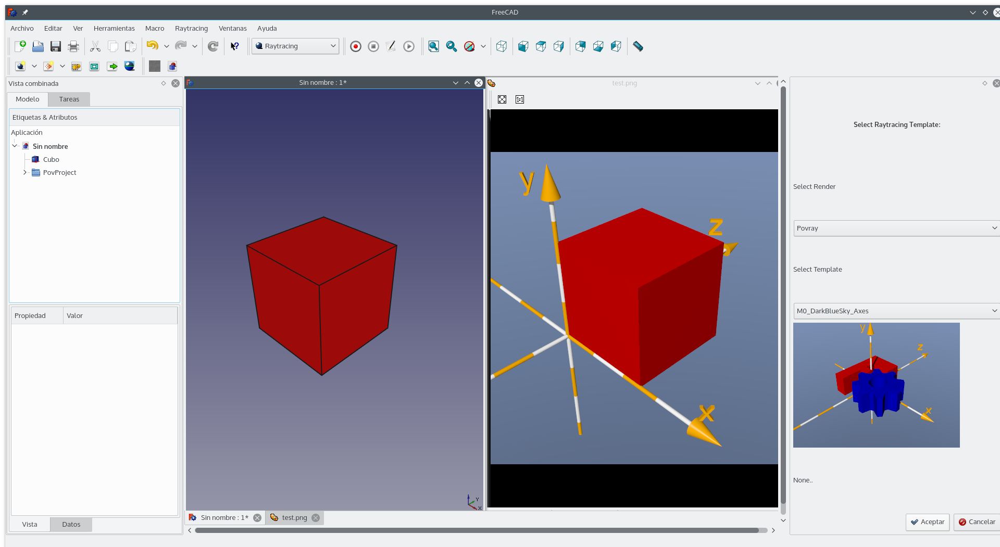

# FreeCAD_Raytracing_Templates

With this macro you can select and preview some templates available for rendering. The idea is to add more templates in the future, and have the option to configure them from the macro itself.

Version 0.1 - 07/02/2016
- You can select the templates available in "Macro_Templates / Pov_Templates"
- You can view the template from "Macro_Templates / Images"
- You can read comments from the template from Macro_Templates / Pov_Comments "

Sorry for my bad English
